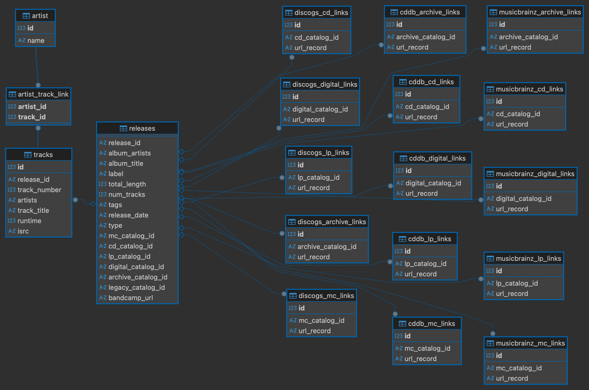

# MCP Server for Music Label Metadata Management

This is an easy to use tool, which helps you add the metadata of your releases to music database services like MusicBrainz, Discogs and CDDB. Currently only MusicBrainz is implemented, the others will follow.
It has an MCP interface, which lets you easily update your data from Bandcamp and fill out forms to add the new releases to MusicBrainz.

# How it works

- manages release metadata in an sqlite database
- pulls the new release metadata from a label's bandcamp site
- assigns a catalog number to the release
- prefill the MusicBrainz form for adding a release
- let the user review it and submit it
- the link to the MusicBrainz record will be added to the database

# Setup

Add an entry to your LLM desktop app config. For claude on Mac this is in `~/Library/Application Support/Claude/claude_desktop_config.json`.

```json
{
  "mcpServers": {
    "music-label-data-filler": {
      "command": "/your/path/to/music-label-data-grooming/.venv/bin/python",
      "args": [
        "/your/path/to/music-label-data-grooming/main.py"
      ],
      "env": {
        "MUSICLABEL": "...",
        "MUSICLABEL_BANDCAMP_URL": "...",
        "MUSICBRAINZ_USERNAME": "...",
        "MUSICBRAINZ_PASSWORD": "...",
        "DIGITAL_RELEASE_PREFIX": "...",
        "CASSETTE_RELEASE_PREFIX": "...",
        "LP_RELEASE_PREFIX": "...",
        "CD_RELEASE_PREFIX": "...",
        "ARCHIVE_RELEASE_PREFIX": "...",
        "SPOTIPY_CLIENT_ID": "",
        "SPOTIPY_CLIENT_SECRET": "",
        "SPOTIPY_REDIRECT_URI": "http://localhost:8888",
        "SPOTIFY_USER_NAME": "..."
      }
    }
  },
}
```

Fill in the data for your music label. The `*_RELEASE_PREFIX` allows you to manage your label's naming convention for catalog numbers. Say your label is "awesome recordings" and your prefix for digital releases is `AR-DIG-"` you can set the value for `DIGITAL_RELEASE_PREFIX` accordingly.
You can also put the values in an `.env` file in the root folder of this repo. An example is in `.env_example`.


# Usage

Chat with your music data filler. Tell it to get the latest releases from bandcamp. Or to add the release "Awesemor Amsomest - Awesome Album" to MusicBrainz. 

# DB Schema
